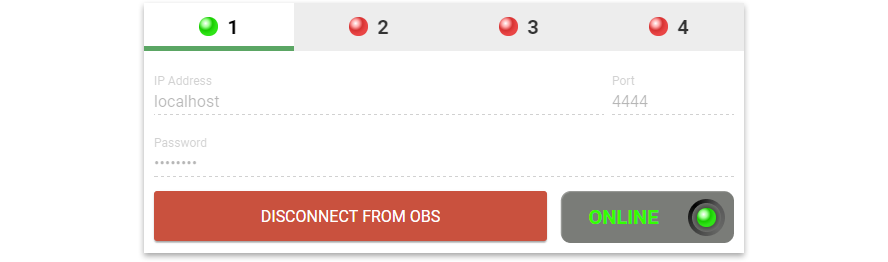

# nodecg-obs [](https://npm.im/nodecg-utility-obs) [](https://travis-ci.org/nodecg/nodecg-obs) [](https://coveralls.io/github/nodecg/nodecg-obs?branch=master) [](https://gitter.im/nodecg/nodecg?utm_source=badge&utm_medium=badge&utm_campaign=pr-badge&utm_content=badge)



[`nodecg-obs`](https://github.com/NodeCG/nodecg-obs) adds the ability to connect to 1-4 instances of OBS (via [`obs-websocket`](https://github.com/Palakis/obs-websocket)) to your NodeCG bundle. It has two parts:
- The backend: [`nodecg-utility-obs`](packages/nodecg-utility-obs), an npm package
    - This is server-side code that runs in Node.js.
- The frontend: [`nodecg-widget-obs`](packages/nodecg-widget-obs), a [Polymer](https://www.polymer-project.org/) element
    - This is client-side code that runs in your browser.
    
In addition, there's a supplementary [Polymer](https://www.polymer-project.org/) element called [`nodecg-obs-scene`](packages/nodecg-obs-scene) that provides realtime data bindings with information about a given scene in OBS.

Once your bundle has connected to OBS, you'll have access to a set of Replicants and Messages that you can use to both control OBS and react to events originating from OBS. For example, you could have code that changes based on what scene is active, or implement a "Transition" button that uses a different transition depending on what scene is being transitioned to. There's a lot of possibilities!

You can think of `nodecg-obs` sort of like a set of mixins for your NodeCG bundle. It is meant for use with NodeCG v0.9. This documentation goes over how to install both `nodecg-utility-obs` and `nodecg-widget-obs` with the default settings to get you up and running as fast as possible.

Internally, `nodecg-obs` uses [`obs-websocket-js`](https://github.com/haganbmj/obs-websocket-js) to communicate with `obs-websocket`.

## Requirements

- NodeCG v0.9 (currently in beta, checkout the latest commit from the [0.9-dev branch](https://github.com/nodecg/nodecg/tree/0.9-dev))
- [Node.js v7 or greater](https://nodejs.org/)
- [OBS Studio](https://obsproject.com/) with [`obs-websocket` v4.2.0 or greater](https://github.com/Palakis/obs-websocket/releases) installed

## Install

`nodecg-utility-obs` and `nodecg-widget-obs` should be installed as dependencies of your bundle.

Due to limitations of Bower, you'll need to install [`bower-npm-resolver`](https://www.npmjs.com/package/bower-npm-resolver) to install `nodecg-widget-obs`.

1. Install `nodecg-utility-obs` and `bower-npm-resolver` via npm:
    ```bash
    cd nodecg/bundles/my-bundle
    npm install --save nodecg-utility-obs bower-npm-resolver
    ```
2. Add `bower-npm-resolver` to a `.bowerrc` file in the root of your bundle (create it if it does not exist):
    ```json
    {
       "resolvers": [
           "bower-npm-resolver"
       ]
    }
    ```
3. Install `nodecg-widget-obs` via Bower
    ```bash
    bower install --save npm:nodecg-widget-obs
    ```

## Table of Contents

* [Example](#example)
* [Features](#features)
* [Planned Features](#planned-features)
* [Contributing](#contributing)
* [Namespaces & connecting to multiple instances of OBS](#multiple-instances)
* [Hooks](#hooks)
  * [`preTransition`](#hooks-preTransition)
* [Replicants](#replicants)
  * [`obs:previewScene`](#previewScene)
  * [`obs:programScene`](#programScene)
  * [`obs:websocket`](#websocket)
  * [`obs:sceneList`](#sceneList)
  * [`obs:transitioning`](#transitioning)
  * [`obs:studioMode`](#studioMode)
  * [`_obs:namespaces`](#namespaces)
* [Messages Sent](#messages-sent)
  * [`obs:transitioning`](#message-transitioning)
* [Messages Received](#messages-received)
  * [`obs:connect`](#message-connect)
  * [`obs:disconnect`](#message-disconnect)
  * [`obs:previewScene`](#message-previewScene)
  * [`obs:transition`](#message-transition)
* [API](#api)
* [Credits](#credits)

### Example

Out of the box, very little configuration is required. You can go more in-depth and do more advanced things if you like, but they're not necessary to get up and running quickly.

First, in your bundle's extension (for example: `nodecg/bundles/my-bundle/extension.js`)
```javascript
const OBSUtility = require('nodecg-utility-obs');
module.exports = function (nodecg) {
    const obs = new OBSUtility(nodecg);
}
```

Then, in one of your bundle's panels (for example: `nodecg/bundles/dashboard/my-panel.html`)
```html
<!DOCTYPE html>
<html lang="en">
<head>
    <meta charset="UTF-8">
	<script src="../bower_components/webcomponentsjs/webcomponents-loader.js"></script>
	<link rel="import" href="../bower_components/nodecg-widget-obs/nodecg-widget-obs.html">
	<style>
		body {
			margin: 0;
		}
	</style>
</head>
<body>
	<nodecg-widget-obs></nodecg-widget-obs>
</body>
</html>
```

The recommended panel `width` (in your `package.json`'s `nodecg` stanza) is `3`.

And that's it! You now have access to all of the Replicants and Messages in your code, and an interface for establishing a connection to OBS. You may begin creating interactions and integrations with OBS in your bundle.

### Features

* Configure the IP, port, and password to use for connections on up to four separate instances of OBS, and monitor the status of these connections.
* Automatic reconnection.
* Replicants that update in real-time to reflect the current state of OBS, accessible from both the backend (extensions) and frontend (dashboard panels & graphics).
* Pre- and post-event hooks for extending `OBSUtility` with your own custom behaviors.
* Full access to the [`obs-websocket-js`](https://github.com/haganbmj/obs-websocket-js) API. `OBSUtility` inherits fully from the `obs-websocket-js` class.
* Uses NodeCG's built-in logging system (which means it can also report errors to [Sentry](https://getsentry.com/)).

### Planned Features

* More pre- and post-event hooks can be added! Feel free to open an [issue](https://github.com/nodecg/nodecg-obs/issues) or a [pull request](https://github.com/nodecg/nodecg-obs/pulls).

### Contributing

The nodecg-obs team enthusiastically welcomes contributions and project participation! There's a bunch of things you can do if you want to contribute! The [Contributor Guide](CONTRIBUTING.md) has all the information you need for everything from reporting bugs to contributing entire new features. Please don't hesitate to jump in if you'd like to, or even ask us questions if something isn't clear.

All participants and maintainers in this project are expected to follow [Code of Conduct](CODE_OF_CONDUCT.md), and just generally be kind to each other.

Please refer to the [Changelog](CHANGELOG.md) for project history details, too.

### <a name="multiple-instances"></a> Namespaces & connecting to multiple instances of OBS

Each individual connection to OBS has a `namespace`. This is used to separate the Replicants and Messages of each instance, 
otherwise they would collide with each other. Changing the **namespace changes the prefix used in** the names of
that instance's **Replicants and Messages**.

By default, `OBSUtility` will use the `obs` namespace. However, if you wish to make multiple instances of `OBSUtility`
(to connect to multiple instances of OBS), you'll need to give each one a unique namespace. Attempting to create
an instance of `OBSUtility` with a namespace that is already in use will throw an error.

#### Example

In your extension:
```javascript
const primaryOBS = new OBSUtility(nodecg, {namespace: 'primaryOBS'});
const secondaryOBS = new OBSUtility(nodecg, {namespace: 'secondaryOBS'});
```

In a dashboard panel:
```javascript
nodecg.sendMessage('primaryOBS:connect', {
    ip: 'localhost',
    port: 4444,
    password: 'foo'
}, err => {
    if (err) {
        console.error(err);
        return;
    }
    
    console.log('successfully connected to primaryOBS');
});

nodecg.sendMessage('secondaryOBS:connect', {
    ip: '192.168.0.122',
    port: 4444,
    password: 'bar'
}, err => {
    if (err) {
        console.error(err);
        return;
    }
    
    console.log('successfully connected to secondaryOBS');
});
```

### Hooks

Sometimes, you may need to alter the behavior of `OBSUtility` or intercept and change data before it is dispatched to OBS. For these cases, a small selection of pre- and post-event hooks are available.

If none of the available hooks fit your use case, please open an [issue](https://github.com/nodecg/nodecg-obs/issues) or, even better, a [pull request](https://github.com/nodecg/nodecg-obs/pulls)!

#### <a name="hooks-preTransition"></a> `> Hook preTransition(transitionOpts)`

This hook runs just before `OBSUtility` sends the [`TransitionToProgram`](https://github.com/Palakis/obs-websocket/blob/master/PROTOCOL.md#transitiontoprogram) message. The `transitionOpts` argument contains a **clone** of the options that `OBSUtility` will send along with this `TransitionToProgram` request. You may make any modificatrions you wish to this object, but **you must return your modified object** for your changes to have effect.

If your `preTransition` hook returns a Promise, `OBSUtility` will wait for it to resolve before continuing. That Promise can return the modified `transitionOpts`, if needed.

##### Example
```js
const obs = new OBSUtility(nodecg, {
    hooks: {
        // If needed, preTransition can be an `async` method, or otherwise return a Promise.
        preTransition(transitionOpts) {
            // If we're transitioning to Scene A, use a Fade.
            // Else, use a Cut.
            transitionOpts['with-transition'] = obs.replicants.previewScene.value.name === 'Scene A' ?
                'Fade' :
                'Cut';

            // Your preTransition hook can optionally return a "transitionOpts" object.
            // This is passed directly to obs-websocket-js' "transitionToProgram" method.
            // If you don't return anything, the defaults will be used.
            return transitionOpts;
        }
    }
});
```

### Replicants

In your extension, all replicants in this utility can be accessed from the `.replicants` property on the `OBSUtility` class:
```js
module.exports = function (nodecg) {
    const obs = new OBSUtility(nodecg);
    obs.replicants.websocket.on('change', () => {/* ... */});
    obs.replicants.programScene.on('change', () => {/* ... */});
    obs.replicants.previewScene.on('change', () => {/* ... */});
    obs.replicants.sceneList.on('change', () => {/* ... */});
    obs.replicants.transitioning.on('change', () => {/* ... */});
    obs.replicants.studioMode.on('change', () => {/* ... */});
};
```

In your dashboard panels and graphics, you'll need to declare them as you would any other Replicant:
```js
const previewScene = nodecg.Replicant('obs:previewScene');
previewScene.on('change', newVal => {
    // ...
});
```

#### <a name="previewScene"></a> `> nodecg.Replicant('obs:previewScene')`

If OBS is in "Studio" mode, this Replicant's `value` will be the current scene that is in Preview.

If OBS is **not** in "Studio" mode, this Replicant's `value` will be `null`.

Relevant Schemas:
 - [`previewScene.json`](packages/nodecg-utility-obs/schemas/previewScene.json)
 - [`types/obs_scene.json`](packages/nodecg-utility-obs/schemas/types/obs_scene.json)
 
#### <a name="programScene"></a> `> nodecg.Replicant('obs:programScene')`
 
If OBS is in "Studio" mode, this Replicant's `value` will be the current scene that is in Program. If OBS is not in "Studio" mode, this Replicant's `value` will be the currently selected scene. In other words, this Replicant always tells you what scene is going out on the stream right now.
 
Relevant Schemas:
 - [`programScene.json`](packages/nodecg-utility-obs/schemas/programScene.json)
 - [`types/obs_scene.json`](packages/nodecg-utility-obs/schemas/types/obs_scene.json)

#### <a name="websocket"></a> `> nodecg.Replicant('obs:websocket')`
 
The configuration and status of the websocket connection to [`obs-websocket`](https://github.com/Palakis/obs-websocket).
 
Relevant Schemas:
 - [`websocket.json`](packages/nodecg-utility-obs/schemas/websocket.json)
 
#### <a name="sceneList"></a> `> nodecg.Replicant('obs:sceneList')`
 
A string array containing the name of every scene currently in OBS.
 
Relevant Schemas:
 - [`sceneList.json`](packages/nodecg-utility-obs/schemas/sceneList.json)
 
#### <a name="transitioning"></a> `> nodecg.Replicant('obs:transitioning')`
 
A boolean that becomes `true` when a transition is in progress and `false` when one isn't.
 
Relevant Schemas:
 - [`transitioning.json`](packages/nodecg-utility-obs/schemas/transitioning.json)
 
#### <a name="studioMode"></a> `> nodecg.Replicant('obs:studioMode')`
 
A boolean that becomes `true` when OBS is in Studio Mode `false` when OBS isn't in Studio Mode.
 
Relevant Schemas:
 - [`studioMode.json`](packages/nodecg-utility-obs/schemas/studioMode.json)
 
#### <a name="namespaces"></a> `> nodecg.Replicant('_obs:namespaces')`
 
A special replicant that is shared between all instances/namespaces. It always uses the name `_obs:namespaces`,
regardless of what namespaces have been used. The purpose of this Replicant is to enable code on the Dashboard
to track how many instances have been created and present separate interfaces for each of those instances.
 
Relevant Schemas:
 - [`namespaces.json`](packages/nodecg-utility-obs/schemas/namespaces.json)
 
### Messages Sent

#### <a name="message-transitioning"></a> `> nodecg.listenFor('obs:transitioning', callback)`

Emitted whenever a transition begins in OBS. First and only argument is an object,
whose only property is `sceneName`; a string of the name of the scene being transitioned to.

##### Example

```javascript
nodecg.listenFor('obs:transitioning', data => {
    console.log(data.sceneName); // logs the name of the scene being transitioned to
});
```

### Messages Received

#### <a name="message-connect"></a> `> nodecg.sendMessage('obs:connect', params, callback)`

Request a connection to an instance of OBS that has [`obs-websocket`](https://github.com/Palakis/obs-websocket) installed.
Each `OBSUtility` instance can connect to one instance of OBS at a time. To connect to multiple instances of OBS,
use multiple instances of `OBSUtility`.

##### Example

```javascript
nodecg.sendMessage('obs:connect', {
    ip: 'localhost',
    port: 4444,
    password: 'foo'
}).then(() => {
    console.log('successfully connected to obs');
}).catch(err => {
    console.error('failed to connect to obs:', err);
});
```

#### <a name="message-disconnect"></a> `> nodecg.sendMessage('obs:disconnect')`

Disconnects from OBS.

##### Example

```js
nodecg.sendMessage('obs:disconnect');
```

#### <a name="message-previewScene"></a> `> nodecg.sendMessage('obs:previewScene', sceneName, callback)`

Requests that the preview scene be changed to `sceneName`. Only works in Studio mode.

##### Example

```js
nodecg.sendMessage('obs:previewScene', 'Foo Scene').then(() => {
    console.log('successfully previewed Foo Scene');
}).catch(err => {
    console.error('failed to preview Foo Scene:', err);
});
```

#### <a name="message-transition"></a> `> nodecg.sendMessage('obs:transition', transitionName, callback)`

Transitions from Preview to Program, using the specified `transitionName`. Use `null` or an empty string (`''`)
to use the default transition in the current instance of OBS.

##### Example

```js
nodecg.sendMessage('obs:transition', 'Fade').then(() => {
    console.log('successfully started a Fade transition');
}).catch(err => {
    console.error('failed to start Fade transition', err);
});
```

### API

`nodecg-obs` extends [`obs-websocket-js`](https://github.com/haganbmj/obs-websocket-js). Please
refer to `obs-websocket-js`'s documentation for a full API.

Use caution when using `obs-websocket-js`'s API directly, as you may be bypassing some or all of
`nodecg-obs`'s functionality.

### Credits

Visual design by [@chrishanel](https://github.com/chrishanel)

